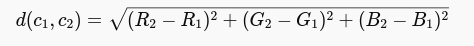
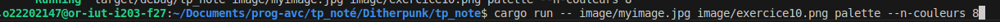

# Ditherpunk

## Auteur:
 - Noa Jacquet : https://github.com/NoaJacquet
 - Antoine Debray : https://github.com/AntoineDebray1


## Objectif du projet


## 1 La bibliothèque image

### Question 1 : Créer un nouveau projet Cargo, avec une dépendance sur la bibliothèque image, version 0.24.9.

Pour créer un nouveau projet Cargo, on peut utiliser la commande `cargo new ditherpunk`. Ensuite, on ajoute la dépendance sur la bibliothèque image dans le fichier Cargo.toml :

```toml
[dependencies]
argh="0.1.13"
image="0.24.9"
```

Enfin, on peut utiliser la commande `cargo build` pour compiler le projet.


### Question 2 : Pour ouvrir une image depuis un fichier, on utilise ImageReader::open("myimage.png")?.decode()?; On obtient un DynamicImage, à quoi correspond ce type? Comment obtenir une image en mode rbg8 à partir de ce DynamicImage?

DynamicImage est une énumération qui permet de représenter une image en mémoire. Elle peut être de plusieurs types, comme RgbaImage, RgbImage, GrayImage, etc. Pour obtenir une image en mode rgb8 à partir d'un DynamicImage, on peut utiliser la méthode to_rgb8().

Ajout des imports :
```rust
use image::{DynamicImage,ImageBuffer,RgbImage};
use image::error::ImageError;
```

Et modification de la fonction main :
```rust
fn main() -> Result<(), ImageError> {
    // let args: DitherArgs = argh::from_env();
    // let path_in = args.input;
    // Ok(())
    let img =  image::io::Reader::open("./image/myimage.png")?.decode()?;
    let rgb8_img: RgbImage = img.to_rgb8();

    return Ok(());
}
```

### Question 3 : Sauver l’image obtenue au format png. Que se passe-t-il si l’image de départ avait un canal alpha?

Pour sauver l'image obtenue au format png, on peut utiliser la méthode save() de l'image. Si l'image de départ avait un canal alpha, la méthode to_rgb8() va supprimer ce canal alpha. Si on veut conserver le canal alpha, on peut utiliser la méthode to_rgba8().

Pour tester avec un canal alpha, on peut utiliser une image png avec un canal alpha. Par exemple, on peut utiliser l'image suivante : des.png.


```rust
fn main() -> Result<(), ImageError> {
    // let args: DitherArgs = argh::from_env();
    // let path_in = args.input;
    // Ok(())
    let img =  image::io::Reader::open("./image/ballon.jpg")?.decode()?;
    let rgb8_img: RgbImage = img.to_rgb8();

    rgb8_img.save("./image/ballon2.png")?;

    return Ok(());
}
```
rendu:


### Question 4 : Afficher daCe travail est à rendre pour le 23 janvier 23h59.ns le terminal la couleur du pixel (32, 52) de l’image de votre choix

Pour afficher la couleur du pixel (32, 52) de l'image, on peut utiliser la méthode get_pixel() de l'image. Cette méthode retourne un Pixel qui contient les valeurs des composantes de couleur du pixel.

```rust
fn main() -> Result<(), ImageError> {
    // let args: DitherArgs = argh::from_env();
    // let path_in = args.input;
    // Ok(())
    let img =  image::io::Reader::open("./image/ballon.png")?.decode()?;
    let rgb8_img: RgbImage = img.to_rgb8();

    rgb8_img.save("./image/ballon2.png")?;
    let pixel = rgb8_img.get_pixel(32, 52);
    println!("Couleur du pixel (32,52) : {:?}", pixel);
    return Ok(());
}
```

rendu


### Question 5
Passer un pixel sur deux d’une image en blanc. Est-ce que l’image obtenue est reconnaissable?

dans un premier temps on va mettre l'imager rgb8 en mutable pour pouvoir modifier les pixels
```rust
    let mut rgb8_img: RgbImage = img.to_rgb8();
```
puis ensuite ont va créer une boucle pour parcourir les pixels de l'image et les modifier avec la varible i qui est initialisé à 0
```rust
    //question 5
    for (x, y, pixel) in rgb8_img.enumerate_pixels_mut() {
        
        if (x+y) % 2 == 0 {

            *pixel = image::Rgb([255, 255, 255]);
        }
    }
    rgb8_img.save("./image/myimage_blanc.png")?;
```


## 2 Passage en monochrome par seuillage

### Question 6 : Comment récupérer la luminosité d’un pixel?

Pour récupérer la luminosité d'un pixel, on peut utiliser le code RGB d'un pixel avec la formule suivante  : `luminosité = 0.2126 * rouge + 0.7152 * vert + 0.0722 * bleu`.


### Question 7 : Implémenter le traitement

Pour implementé ce traitement on va créer une fonction qui va prendre en paramètre un pixel et qui va retourner la valeur de la luminosité.

```rust
fn calcul_liminosite(pixel: [u8; 3]) -> f32 {
    return 0.2126 * pixel[0] as f32 + 0.7152 * pixel[1] as f32 + 0.0722 * pixel[2] as f32;
}
```


Dans un premier temps nous avons simplifier l'image pour quelle ne contienne que du noir et du blanc en fonction de la luminosité du pixel.

```rust
    for (x, y, pixel) in rgb8_img.enumerate_pixels_mut() {
        let luminosite = calcul_liminosite(pixel.0);
        if luminosite > 128.0 {
            *pixel = image::Rgb([255, 255, 255]);
        } else {
            *pixel = image::Rgb([0, 0, 0]);
        }
    }
    rgb8_img.save("./image/myimage_noir_blanc.png")?;
```


### Question 8 : Permettre à l’utilisateurice de remplacer “noir” et “blanc” par une paire de couleurs au choix

Dans un premier temps, il faut modifier la structure de seuil pour quelle prenne en paramètre deux couleurs.

```rust
struct OptsSeuil {
    /// première couleur
    #[argh(option)]
    couleur1: Option<String>,

    /// deuxième couleur
    #[argh(option)]
    couleur2: Option<String>,
}
```

puis nous allons modifier la fonction main pour quelle recupere les couleurs inserer par l'utilisateur et les chemins des images en entrée et en sortie.
Anisi que la creation d'un dictionary pour les couleurs.


```rust
let args: DitherArgs = argh::from_env();
    let img = image::io::Reader::open(&args.input)?.decode()?;
    let mut rgb8_img: RgbImage = img.to_rgb8();
    let couleurs: HashMap<&str, [u8; 3]> = [
        ("noir", [0, 0, 0]),
        ("blanc", [255, 255, 255]),
        ("rouge", [255, 0, 0]),
        ("vert", [0, 255, 0]),
        ("bleu", [0, 0, 255]),
        ("jaune", [255, 255, 0]),
        ("cyan", [0, 255, 255]),
        ("magenta", [255, 0, 255]),
    ]
    .iter()
    .cloned()
    .collect();

```
```rust
//question 8
    match &args.mode {
        Mode::Seuil(opts) => {
            let couleur1 = if let Some(c1) = &opts.couleur1 {
                couleurs.get(c1.to_lowercase().as_str()).unwrap_or(&[0, 0, 0]) // Noir si non trouvé
            } else {
                &[0, 0, 0] // Noir si non défini
            };
        
            // Gestion de couleur2 (Blanc par défaut)
            let couleur2 = if let Some(c2) = &opts.couleur2 {
                couleurs.get(c2.to_lowercase().as_str()).unwrap_or(&[255, 255, 255]) // Blanc si non trouvé
            } else {
                &[255, 255, 255] // Blanc si non défini
            };
        
            for pixel in rgb8_img.pixels_mut() {
                let luminosite = calcul_luminosite(pixel.0);
                *pixel = if luminosite > 128.0 {
                    image::Rgb(*couleur2) // Lumineux → Couleur claire (blanc par défaut)
                } else {
                    image::Rgb(*couleur1) // Sombre → Couleur sombre (noir par défaut)
                };
            }
        }
    }
    if let Some(output) = args.output {
        rgb8_img.save(output)?;
    }
```

Donc pour tester le programme on peut utiliser la commande suivante:


ce qui nous donne l'image suivante:


## 3 Passage à une palette

### Question 9 : Comment calculer la distance entre deux couleurs?

L'une des méthodes courantes pour calculer la distance entre deux couleurs en espace RGB est la distance euclidienne dans l’espace 3D des couleurs :


ce qui correspon à la racine carrée de la somme des carrés des différences entre les composantes de couleur.

### Question 10 : Implémenter le calcul de distance

Ajout de la fonction de calcul de distance euclidienne entre deux couleurs :

```rust
fn distance_euclidienne(c1: [u8; 3], c2: [u8; 3]) -> f32 {
    let r_diff = (c1[0] as f32 - c2[0] as f32).powi(2);
    let g_diff = (c1[1] as f32 - c2[1] as f32).powi(2);
    let b_diff = (c1[2] as f32 - c2[2] as f32).powi(2);
    
    (r_diff + g_diff + b_diff).sqrt()
}
```

Ajout de la fonction de recherche de la couleur la plus proche dans une palette :

```rust
fn couleur_plus_proche(pixel: [u8; 3], palette: &[[u8; 3]]) -> [u8; 3] {
    *palette.iter()
        .min_by(|&&c1, &&c2|
            distance_euclidienne(pixel, c1)
                .partial_cmp(&distance_euclidienne(pixel, c2))
                .unwrap()
        )
        .unwrap()
}
```

Enfin ajout de la fonction de conversion de l'image en palette :

```rust
n palette_reduite(img: &mut RgbImage, n_couleurs: usize) {
    // Palette des couleurs de base (NOIR, BLANC, ROUGE, VERT, BLEU, JAUNE, CYAN, MAGENTA)
    let palette: Vec<[u8; 3]> = vec![
        [0, 0, 0], // Noir
        [255, 255, 255], // Blanc
        [255, 0, 0], // Rouge
        [0, 255, 0], // Vert
        [0, 0, 255], // Bleu
        [255, 255, 0], // Jaune
        [0, 255, 255], // Cyan
        [255, 0, 255], // Magenta
    ];
    if n_couleurs == 0 {
        println!("⚠️ Erreur : La palette ne peut pas être vide !");
        return; // Ne modifie pas l'image
    }

    // Limiter la palette à n_couleurs
    let palette = &palette[..n_couleurs];

    // Parcourir chaque pixel et trouver la couleur la plus proche dans la palette
    for pixel in img.pixels_mut() {
        let couleur_pixel = pixel.0; // RGB de ce pixel
        let couleur_proche = couleur_plus_proche(couleur_pixel, palette);
        *pixel = image::Rgb(couleur_proche);
    }
}
```

Pour finir modification du main pour prendre en compte la conversion de l'image en palette :

```rust
match &args.mode {
        Mode::Seuil(opts) => {
            let couleur1 = couleurs.get(opts.couleur1.to_lowercase().as_str()).unwrap_or(&[0, 0, 0]);
            let couleur2 = couleurs.get(opts.couleur2.to_lowercase().as_str()).unwrap_or(&[255, 255, 255]);
            
            for pixel in rgb8_img.pixels_mut() {
                let luminosite = calcul_luminosite(pixel.0);
                *pixel = if luminosite > 128.0 {
                    image::Rgb(*couleur2)
                } else {
                    image::Rgb(*couleur1)
                };
            }
        }
        Mode::Palette(opts) => {
            palette_reduite(&mut rgb8_img, opts.n_couleurs);
        }
    }
   
    if let Some(output) = args.output {
        rgb8_img.save(output)?;
    }
```

Pour tester le programme on peut utiliser la commande suivante:



ce qui nous donne l'image suivante:


### Question 11 : Votre application doit se comporter correctement si on donne une palette vide

Pour éviter une erreur si la palette est vide, on peut ajouter une vérification dans la main verifiant si la palette est vide, egale à 0, et afficher un message d'erreur si c'est le cas.

```rust
Mode::Palette(opts) => {
            if opts.n_couleurs == 0{
                eprintln!("Erreur : Vous devez spécifier au moins 1 couleur pour la palette.");
                std::process::exit(1); // Quitte le programme avec une erreur
            }
            palette_reduite(&mut rgb8_img, opts.n_couleurs);
        }
```

### Question 12 : Tramage aleatoire

On créé d'abord la fonction permettant d'effectuer le tramage aléatoire.

```rust
fn tramage_aleatoire(img: &mut RgbImage) {
    let mut rng = rand::thread_rng();

    for pixel in img.pixels_mut() {
        let luminosite = calcul_luminosite(pixel.0);
        let seuil_aleatoire: f32 = rng.gen(); // Génère un nombre aléatoire entre 0 et 1

        *pixel = if luminosite / 255.0 > seuil_aleatoire {
            image::Rgb([255, 255, 255]) // Blanc
        } else {
            image::Rgb([0, 0, 0]) // Noir
        };
    }
}
```
Puis on implémente ce qui est nécessaire à son appel.

```rust
#[derive(Debug, Clone, PartialEq, FromArgs)]
#[argh(subcommand)]
enum Mode {
    Seuil(OptsSeuil),
    Palette(OptsPalette),
    Tramage(OptsTramage),
}
```

```rust
#[derive(Debug, Clone, PartialEq, FromArgs)]
#[argh(subcommand, name="tramage")]
/// Rendu de l’image par seuillage monochrome.
struct OptsTramage {

}
```

```rust
Mode::Tramage(_) => {
    tramage_aleatoire(&mut rgb8_img);
}
```

### Question 13 : Déterminez B3

```
B3 = 1/64 * [
0   32    8   40    2   34   10   42
48   16   56   24   50   18   58   26
12   44    4   36   14   46    6   38
60   28   52   20   62   30   54   22
3   35   11   43    1   33    9   41
51   19   59   27   49   17   57   25
15   47    7   39   13   45    5   37
63   31   55   23   61   29   53   21
]
```

### Question 14 : 

Afin d'implémenter une matrice de Bayer, le type de données qui nous semble le plus judicieux est un tableau 2D type Vec<Vec<u32>>.

Ce type de données permet de représenter une grande plage de données et a une précision suffisante pour les indices de matrices.

```rust
fn generer_matrice_bayer(n: u32) -> Vec<Vec<u8>> {
    if n == 0 {
        return vec![vec![0]];
    }
    let taille = 2usize.pow(n);
    let taille_precedente = taille / 2;
    let matrice_precedente = generer_matrice_bayer(n - 1);
    let mut matrice = vec![vec![0; taille]; taille];
    for i in 0..taille_precedente {
        for j in 0..taille_precedente {
            let valeur = matrice_precedente[i][j];
            matrice[i][j] = 4 * valeur;
            matrice[i][j + taille_precedente] = 4 * valeur + 2;
            matrice[i + taille_precedente][j] = 4 * valeur + 3;
            matrice[i + taille_precedente][j + taille_precedente] = 4 * valeur + 1;
        }
    } 
    matrice
 }
```