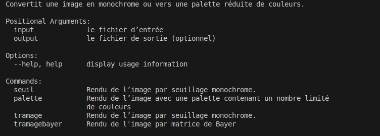

# Ditherpunk

## Auteur:
 - Noa Jacquet : https://github.com/NoaJacquet
 - Antoine Debray : https://github.com/AntoineDebray1


## Objectif du projet


### Question 1 : Créer un nouveau projet Cargo, avec une dépendance sur la bibliothèque image, version 0.24.9.

Pour créer un nouveau projet Cargo, on peut utiliser la commande `cargo new ditherpunk`. Ensuite, on ajoute la dépendance sur la bibliothèque image dans le fichier Cargo.toml :

```toml
[dependencies]
argh="0.1.13"
image="0.24.9"
```

Enfin, on peut utiliser la commande `cargo build` pour compiler le projet.


### Question 2 : Pour ouvrir une image depuis un fichier, on utilise ImageReader::open("myimage.png")?.decode()?; On obtient un DynamicImage, à quoi correspond ce type? Comment obtenir une image en mode rbg8 à partir de ce DynamicImage?

DynamicImage est une énumération qui permet de représenter une image en mémoire. Elle peut être de plusieurs types, comme RgbaImage, RgbImage, GrayImage, etc. Pour obtenir une image en mode rgb8 à partir d'un DynamicImage, on peut utiliser la méthode to_rgb8().

Ajout des imports :
```rust
use image::{DynamicImage,ImageBuffer,RgbImage};
use image::error::ImageError;
```

Et modification de la fonction main :
```rust
fn main() -> Result<(), ImageError> {
    // let args: DitherArgs = argh::from_env();
    // let path_in = args.input;
    // Ok(())
    let img =  image::io::Reader::open("./image/myimage.png")?.decode()?;
    let rgb8_img: RgbImage = img.to_rgb8();

    return Ok(());
}
```

### Question 3 : Sauver l’image obtenue au format png. Que se passe-t-il si l’image de départ avait un canal alpha?

Pour sauver l'image obtenue au format png, on peut utiliser la méthode save() de l'image. Si l'image de départ avait un canal alpha, la méthode to_rgb8() va supprimer ce canal alpha. Si on veut conserver le canal alpha, on peut utiliser la méthode to_rgba8().

Pour tester avec un canal alpha, on peut utiliser une image png avec un canal alpha. Par exemple, on peut utiliser l'image suivante : des.png.


```rust
fn main() -> Result<(), ImageError> {
    // let args: DitherArgs = argh::from_env();
    // let path_in = args.input;
    // Ok(())
    let img =  image::io::Reader::open("./image/ballon.jpg")?.decode()?;
    let rgb8_img: RgbImage = img.to_rgb8();

    rgb8_img.save("./image/ballon2.png")?;

    return Ok(());
}
```
rendu:


### Question 4 : Afficher daCe travail est à rendre pour le 23 janvier 23h59.ns le terminal la couleur du pixel (32, 52) de l’image de votre choix

Pour afficher la couleur du pixel (32, 52) de l'image, on peut utiliser la méthode get_pixel() de l'image. Cette méthode retourne un Pixel qui contient les valeurs des composantes de couleur du pixel.

```rust
fn main() -> Result<(), ImageError> {
    // let args: DitherArgs = argh::from_env();
    // let path_in = args.input;
    // Ok(())
    let img =  image::io::Reader::open("./image/ballon.png")?.decode()?;
    let rgb8_img: RgbImage = img.to_rgb8();

    rgb8_img.save("./image/ballon2.png")?;
    let pixel = rgb8_img.get_pixel(32, 52);
    println!("Couleur du pixel (32,52) : {:?}", pixel);
    return Ok(());
}
```

rendu



### Question 5
Passer un pixel sur deux d’une image en blanc. Est-ce que l’image obtenue est reconnaissable?

dans un premier temps on va mettre l'imager rgb8 en mutable pour pouvoir modifier les pixels
```rust
    let mut rgb8_img: RgbImage = img.to_rgb8();
```
puis ensuite ont va créer une boucle pour parcourir les pixels de l'image et les modifier avec la varible i qui est initialisé à 0
```rust
    //question 5
    for (x, y, pixel) in rgb8_img.enumerate_pixels_mut() {
        
        if (x+y) % 2 == 0 {

            *pixel = image::Rgb([255, 255, 255]);
        }
    }
    rgb8_img.save("./image/myimage_blanc.png")?;
```


### Question 6 : Comment récupérer la luminosité d’un pixel?

Pour récupérer la luminosité d'un pixel, on peut utiliser le code RGB d'un pixel avec la formule suivante  : `luminosité = 0.2126 * rouge + 0.7152 * vert + 0.0722 * bleu`.


### Question 7 : Implémenter le traitement

Pour implementé ce traitement on va créer une fonction qui va prendre en paramètre un pixel et qui va retourner la valeur de la luminosité.

```rust
fn calcul_liminosite(pixel: [u8; 3]) -> f32 {
    return 0.2126 * pixel[0] as f32 + 0.7152 * pixel[1] as f32 + 0.0722 * pixel[2] as f32;
}
```


Dans un premier temps nous avons simplifier l'image pour quelle ne contienne que du noir et du blanc en fonction de la luminosité du pixel.

```rust
    for (x, y, pixel) in rgb8_img.enumerate_pixels_mut() {
        let luminosite = calcul_liminosite(pixel.0);
        if luminosite > 128.0 {
            *pixel = image::Rgb([255, 255, 255]);
        } else {
            *pixel = image::Rgb([0, 0, 0]);
        }
    }
    rgb8_img.save("./image/myimage_noir_blanc.png")?;
```


### Question 8 : Permettre à l’utilisateurice de remplacer “noir” et “blanc” par une paire de couleurs au choix

Dans un modifier la structure de seuil pour quelle prenne en paramètre deux couleurs.

```rust
struct OptsSeuil {
    /// première couleur
    #[argh(option)]
    couleur1: String,

    /// deuxième couleur
    #[argh(option)]
    couleur2: String,
}
```

puis nous allons modifier la fonction main pour quelle recupere les couleurs inserer par l'utilisateur et les chemins des images en entrée et en sortie.
Anisi que la creation d'un dictionary pour les couleurs.


```rust
let args: DitherArgs = argh::from_env();
    let img = image::io::Reader::open(&args.input)?.decode()?;
    let mut rgb8_img: RgbImage = img.to_rgb8();
    let couleurs: HashMap<&str, [u8; 3]> = [
        ("noir", [0, 0, 0]),
        ("blanc", [255, 255, 255]),
        ("rouge", [255, 0, 0]),
        ("vert", [0, 255, 0]),
        ("bleu", [0, 0, 255]),
        ("jaune", [255, 255, 0]),
        ("cyan", [0, 255, 255]),
        ("magenta", [255, 0, 255]),
    ]
    .iter()
    .cloned()
    .collect();

```
```rust
//question 8
    match &args.mode {
        Mode::Seuil(opts) => {
            let couleur1 = couleurs.get(opts.couleur1.to_lowercase().as_str()).unwrap_or(&[0, 0, 0]);
            let couleur2 = couleurs.get(opts.couleur2.to_lowercase().as_str()).unwrap_or(&[255, 255, 255]);
            
            for pixel in rgb8_img.pixels_mut() {
                let luminosite = calcul_luminosite(pixel.0);
                *pixel = if luminosite > 128.0 {
                    image::Rgb(*couleur2)
                } else {
                    image::Rgb(*couleur1)
                };
            }
        }
        Mode::Palette(opts) => {
            println!("Mode palette avec {} couleurs", opts.n_couleurs);
            // Implémentation du mode palette si nécessaire
        }
    }
    if let Some(output) = args.output {
        rgb8_img.save(output)?;
    }
```

Donc pour tester le programme on peut utiliser la commande suivante:


ce qui nous donne l'image suivante:

